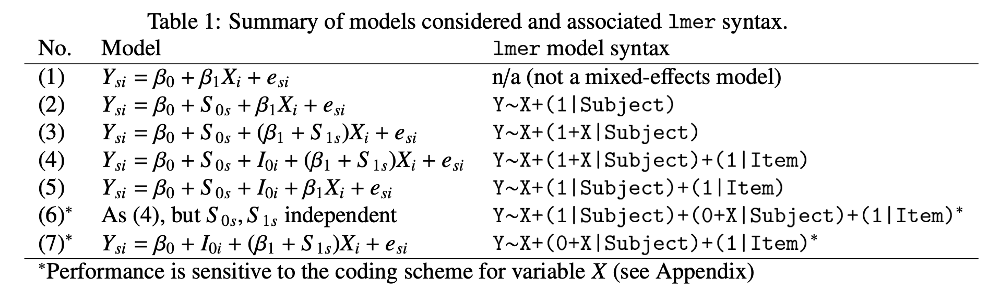

# Linear Regression

## Definition

Suppose that a random sample from size $n$ is drawn from a population, and measurements $(x_{i1}, x_{i2}...x_{ik}, y_i)$ where $i = 1, ... , n$, are obtained on the n individuals.

The random variables $x_{i1}, x_{i2}...x_{ik}$ are commonly termed as *predictor variables* (or simply, predictors), but depending on the field of application, they may also be called *independent variables*, *regressors*, *features*, *covariates* or *explanatory variables*.

The $y_i$ variable is called the *response variable* (or simply, response). Other terms include *target variable*, *variate*, *dependent variable* or *outcome variable*.

The Linear Regression Model represents a relation between the response variable $y$ and the predictor variables $x_{1}, x_{2}...x_{k}$ (with the lowercase notation for simplicity) of the form:

$$ 
\begin{align}
y = \beta_0 + \beta_1 + ... + \beta_k + \epsilon
\end{align} 
$$

Where $\beta_0, ..., \beta_k$ are constants *regression coefficients*, and $\epsilon$ is a random error term that follows a normal distribution with mean zero ($\mu = 0$) and constant variance $\sigma^2$. That is, $\epsilon \sim Norm(\mu = 0, \sigma^2)$. Also, the random errors are assumed to be independent for different individuals of the sample.

The parameters of the model $\beta_0, ..., \beta_k$, and the variance $\sigma^2$ are unknown and have to be estimated from the sample data.

Note that the relationship between the predictors and the response is not necessarily linear, as polynomial or interaction terms may be included, but it is necessarily linear in the beta coefficients. That is, the relationship is modeled as a linear combination of the parameters.

Note that, in the general linear regression model, the response variable y has a normal distribution with the mean:

$$ 
\begin{align}
\mathbb{E}(y) = \beta_0 + \beta_1 \cdot x_1 + ... + \beta_k \cdot x_k
\end{align} 
$$

## Simple Linear Regression

Simple linear regression is a simplification of the Linear Regression Model that estimates the relationship between one independent variable and one dependent variable using a straight line. Both variables should be quantitative.

For this example, we'll use the `Boston` dataset, which contains 506 census tracts in Boston. We will seek to predict `medv`, the median house value, using the `lstat` predictor, which represents the percent of households with low socioeconomic status.

```{r}
df <- read.csv("./datasets/Boston.csv")
head(df)
```

We will start by using the `lm` function to fit a simple linear regression model, with `medv` as the response and `lstat` as the predictor. The basic syntax is `lm(y ∼ x, data)`, where y is the response, x is the predictor, and data is the data set (usually a dataframe) in which these two variables are kept.

```{r}
linear_reg <- lm(formula = medv ~ lstat, data = df)
```

If we type the name of the variable, which in this case is `linear_reg` some basic information about the model is output.

```{r}
linear_reg
```

For more detailed information, we use `summary(linear_reg)`. This gives us p-values and standard errors for the coefficients, as well as the $R^2$ statistic and $F$-statistic for the model.

```{r}
summary(linear_reg)
```

We can also plot the linear regression line using `ggplot2`:

```{r}
ggplot(data = df,
       mapping = aes(x = lstat,
                     y = medv, 
                     col = medv)) +
  geom_point() +
  geom_smooth(method=lm, formula = y ~ x, col="red") +
  guides(col="none")
```

## Polynomial Regression

It is also possible to fit a polynomial regression model by using the `poly` function, whose first argument is the variable and the second is the degree of the polynomial.

```{r}
polynomial_reg <- lm(formula=medv~poly(lstat, 2), data=df)
polynomial_reg

```

It is also possible to print the summary of the model, by using the aforementioned `summary` function.

```{r}
summary(polynomial_reg)
```

Similarly, we can plot this polynomial regression model using `ggplot2`:

```{r}
ggplot(data = df,
       mapping = aes(x = lstat,
                     y = medv, 
                     col = medv)) +
  geom_point(col="red") +
  geom_smooth(method=lm, formula = y ~ poly(x, 2), col="green") +
  guides(col="none")
```

## Multiple Linear Regression

We will continue to use the `Boston` dataset in order to predict `medv` using several predictors such as `rm` (average number of rooms per house), `age` (average age of houses), and `lstat` (percent of households with low socioeconomic status).

In order to fit a multiple linear regression model using least squares, we again use the `lm` function. The syntax `lm(y ∼ x1 + x2 + x3)` is used to fit a model with three predictors, $x_1$, $x_2$, and $x_3$. The `summary` function now outputs the regression coefficients for all the predictors.

```{r}
linear_reg <- lm(medv ~ lstat + age, data = df)
summary(linear_reg)
```

The Boston data set contains 12 variables, and so it would be cumbersome to have to type all of these in order to perform a regression using all of the predictors. Instead, we can use the following short-hand:

```{r}
linear_reg <- lm(medv ~ ., data = df)
summary(linear_reg)
```

## Wilkinson-Rogers Notation

The feature of detailing all variables by using a `.` placeholder is possible because R uses Wilkinson and Rogers' (1973) notation, which allows us to write the algebraic formula that defines a statistical model.
This notation is commonly used in R, Python & MATLAB statistical libraries.
Below is a table in which the symbols that helps write formulas to represent statistical models appear.

{width=85%}
